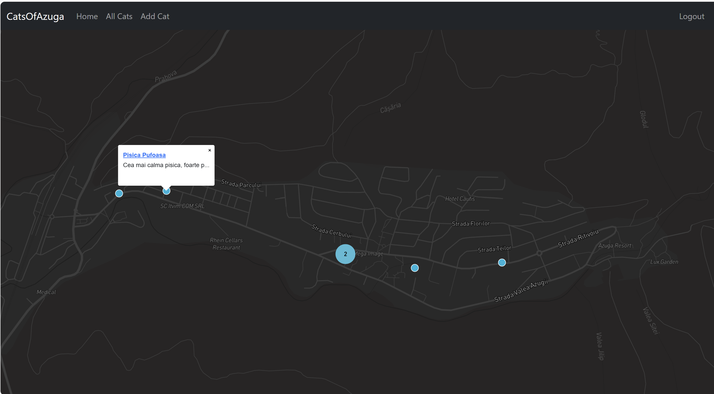
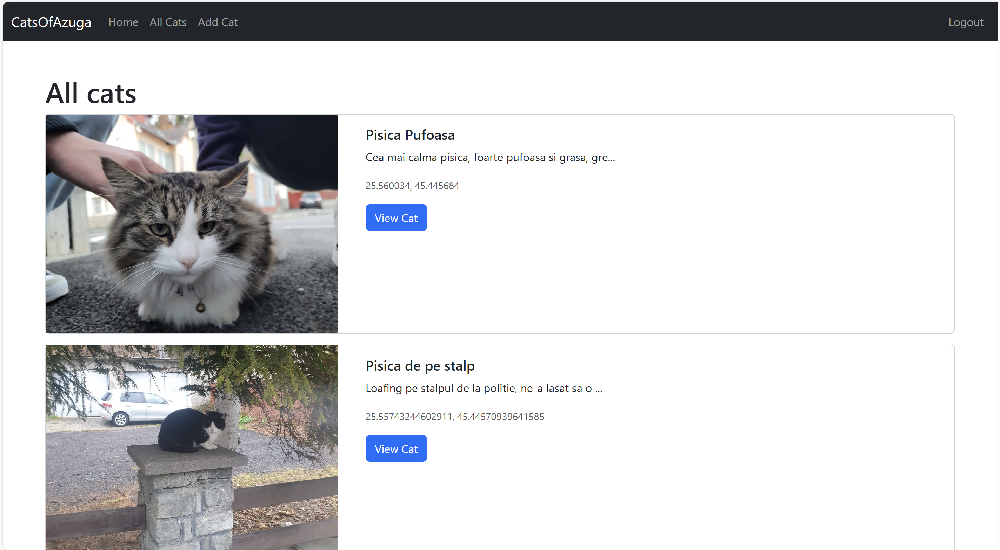
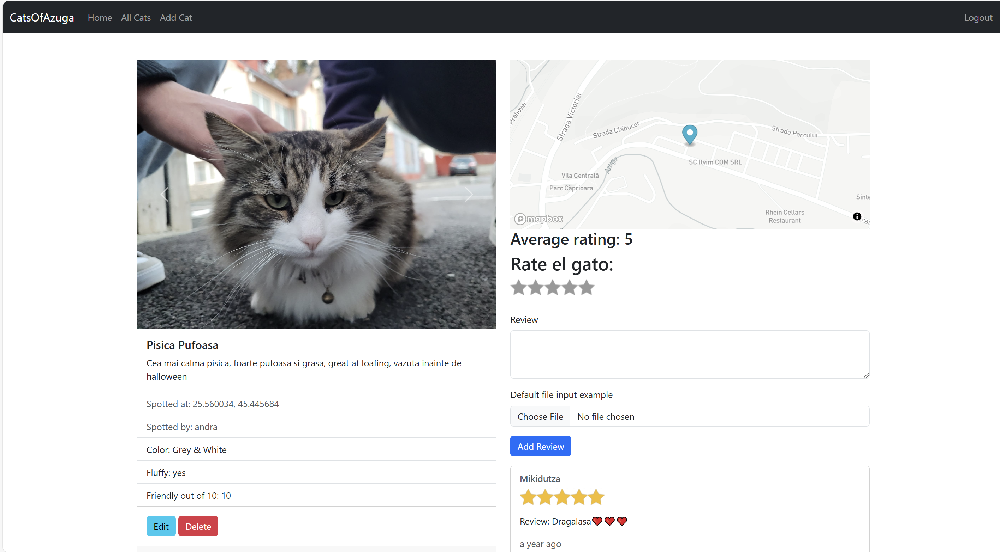
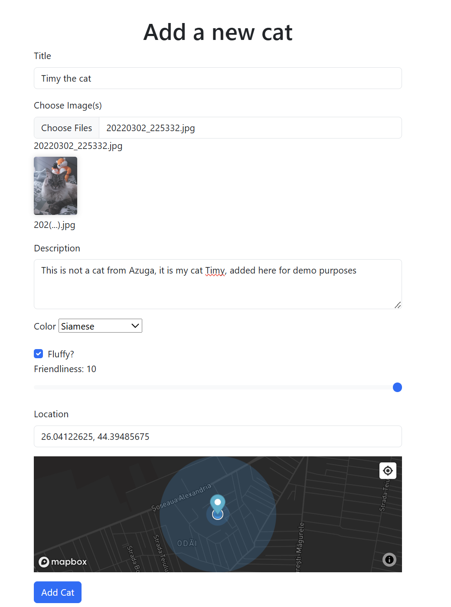

# 🐱 Cats of Azuga

A web application where users can upload photos, rate, and comment on cats spotted in the mountain village of Azuga, Romania! This project was built using **Node.js**, **Express.js**, **MongoDB**, and **Mapbox** for interactive maps.

## 🌟 Features

- Users can upload cat sightings along with images, descriptions, and location data.
- Rate and review cats with an interactive rating system.
- View all cat sightings on a map, with individual cat detail pages showing precise locations.
- Image upload support with Cloudinary.
- User authentication for adding reviews and cat entries.

## 📋 Table of Contents

- [Demo](#demo)
- [Technologies](#technologies)
- [Project Setup](#project-setup)
- [Environment Variables](#environment-variables)
- [Usage](#usage)
- [License](#license)

## 🚀 Demo

Check out the live demo at: [Cats of Azuga](https://cats-of-azuga-service-670894227736.europe-west1.run.app/)

## 🛠 Technologies

This project is built using the following technologies:

- **Node.js**: Backend JavaScript runtime.
- **Express.js**: Web framework for Node.js.
- **MongoDB (Atlas)**: Database to store cats, users, and reviews.
- **Mapbox**: Interactive maps to display cat locations.
- **Passport.js**: User authentication for login and registration.
- **Cloudinary**: Image storage and delivery.
- **Mongoose**: MongoDB ODM to model cat and review data.
- **EJS**: Templating engine for server-side rendering.
- **Bootstrap**: Frontend framework for responsive design.

## ⚙️ Project Setup

To set up the **Cats of Azuga** project locally, follow these steps:

### 1. Clone the Repository

First, clone the repository to your local machine:

```bash
git clone https://github.com/your-username/cats-of-azuga.git
cd cats-of-azuga
```
### 2. Install Dependencies
Make sure you have Node.js installed, and then install the required packages by running:

```bash
npm install
```
### 3. Environment Variables
Create a .env file in the root of the project. You will need the following environment variables:

```bash
# MongoDB connection URL
DB_URL=mongodb+srv://<username>:<password>@cluster0.mongodb.net/catsofazuga

# Session secret (for express-session)
SECRET=your-secret-here

# Cloudinary credentials
CLOUDINARY_CLOUD_NAME=your-cloudinary-cloud-name
CLOUDINARY_KEY=your-cloudinary-api-key
CLOUDINARY_SECRET=your-cloudinary-api-secret

# Mapbox API Token
MAPBOX_TOKEN=your-mapbox-token
```
### 4. Start MongoDB (if using locally)
If you're running MongoDB locally, start MongoDB on your machine:

```bash
mongod
```
Or, if you're using MongoDB Atlas, ensure that your DB_URL in .env points to your Atlas cluster.

### 5. Run the Application
Once everything is set up, start the application:

```bash
npm run dev
```
Open your browser and navigate to http://localhost:3000.

## 📑 Environment Variables
You need to configure the following environment variables in your .env file:

```bash
DB_URL: MongoDB connection string.
SECRET: Secret for encrypting session data.
CLOUDINARY_CLOUD_NAME: Your Cloudinary account cloud name.
CLOUDINARY_KEY: Your Cloudinary API key.
CLOUDINARY_SECRET: Your Cloudinary API secret.
MAPBOX_TOKEN: Your Mapbox API token for displaying maps
```
## 🔍 Usage
Once the project is set up and running, you can:

Add a Cat: Upload a cat's picture, add location, and description.
Rate and Review: Interact with the cat detail page by rating and reviewing.
Browse Cats: View all uploaded cats and their details, including ratings and locations.
## 📷 Screenshots
Home Page:


All cats Page:


Cat Detail Page:


Add Cat Page:



